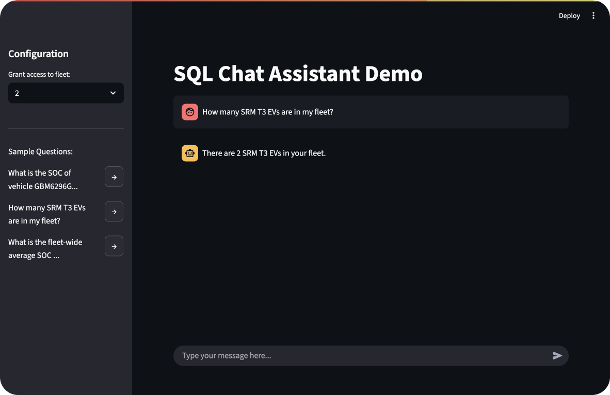

# EV Fleet Analytics AI Assistant

A natural language interface for querying electric vehicle fleet telemetry data. 

<br>



<br>

## 🌟 Features

- Natural language to SQL conversion for fleet analytics
- LangGraph-based LLM agent with groq-api
- PostgreSQL with RBAC
- JWT-based authentication

<br>

## 🏗 Architecture

```
┌─────────────┐     ┌─────────────┐     ┌──────────────┐     ┌────────────┐
│  Streamlit  │     │   FastAPI   │     │  LangChain   │     │ PostgreSQL │
│  Frontend   ├─────┤   Backend   ├─────┤  LLM Agent   ├─────┤    DB      │
└─────────────┘     └─────────────┘     └──────────────┘     └────────────┘
                            │                                        │
                            │            Row-Level Security          │
                            └────────────────────────────────────────┘
```

<br>

## 📁 Project Structure

```
.
├── Makefile                    
├── docker-compose.yml    
│   
├── backend/                   
│   ├── Dockerfile
│   ├── requirements.txt
│   ├── core/
│   │   ├── db_con.py              # Database connection 
│   │   ├── llm_agent/             # LLM agent & semantic mapping
│   │   ├── setup-ssl-certs.sh  
│   │   └── setup_database/     
│   │       ├── setup_database.py  # Sets up tables + roles with RLS
│   │       └── import_data.py     # Seed database
│   ├── data/                      # Data samples
│   ├── routes/                
│   │   ├── auth/                  # JWT auth endpoint
│   │   └── chat/                  # LLM chat endpoint
│   ├── tests/                  
│   ├── setup_render.py            # Render-specific server setup 
│   └── main.py                    # FastAPI app
│  
└── frontend/                  
    ├── Dockerfile
    ├── requirements.txt                   
    └── main.py                    # Streamlit app
```


## 🌐 Live Demo

**Try it out online!** 🚀

| Service | URL |
|---------|-----|
| **Frontend** | [https://genai-sql-2-frontend.onrender.com/](https://genai-sql-2-frontend.onrender.com/) |
| **Backend API** | [https://genai-sql-2.onrender.com/](https://genai-sql-2.onrender.com/) |
| **API Doc** | [https://genai-sql-2.onrender.com/redoc](https://genai-sql-2.onrender.com/redoc) |

> ⚠️ **Note:** Free-tier LLM calls are limited.

<br>

## 🚀 Quick Start

Requirements:
- docker
- docker compose (not docker-compose)

### 1. Development:

   ```bash
   git clone https://github.com/Jamessukanto/genai-sql.git
   cd genai-sql

   # Get your API key at https://groq.com/
   export GROQ_API_KEY="get_your_api_key"
   ```
   <br>

   ```bash
   # Start backend, frontend, and database services:
   # (This sets up the database and seeds sample data, too)
   # View frontend container at http://localhost:8501/
   make dev

   # To pull them down:
   # (This remove volumes, too)
   make clean

   ```

   <br>


   <details>
   <summary><strong>Debug</strong></summary>

   ```bash
   # View logs
   docker compose logs frontend
   docker compose logs backend
   docker compose logs db
   ```

   </details>

### 2. Test:
   ```bash
   make test
   ```


## 📜 License

This project is licensed under the MIT License - see the LICENSE file for details.


